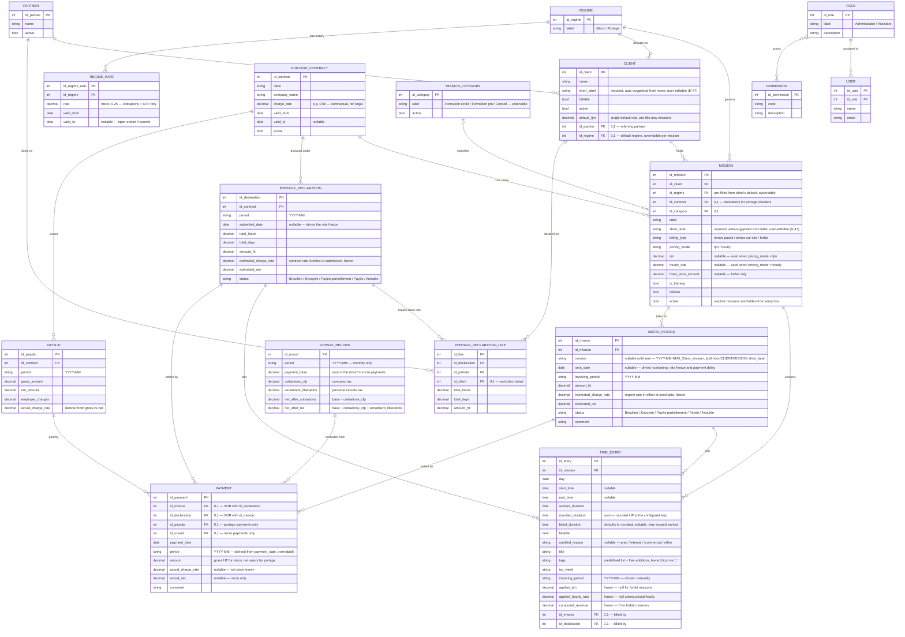
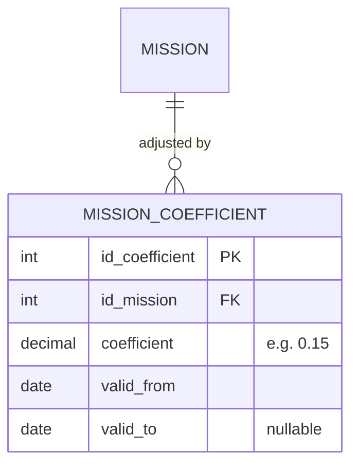

# SynFactu — Conceptual Data Model (MCD V2)

> Merise-style conceptual data model for SynFactu, referenced by section 4 of `Spécification fonctionnelle v2.md`.
>
> This model is self-contained: it is the complete definition of the V1 database. The reasoning behind each choice, and the alternatives rejected, is recorded in `Décisions v2.md` — referenced throughout as *(D-nn)*.
>
> Domain terms with no clean English equivalent are kept as-is: TJM, URSSAF, portage, CFP, versement libératoire.
>
> **Phase markers**: entities marked *(Phase 2)* are designed now and built later. They are part of the model from the start so nothing has to be retrofitted.

---

## 1. Entity-Relationship Diagram

> `PAYMENT`, `PAYSLIP` and `URSSAF_RECORD` are **Phase 2**. `USER` / `ROLE` / `PERMISSION` are conceptual only in V1 — there is no login *(D-40)* — and will be mapped onto Better Auth's schema rather than duplicated.

Two configuration entities complete the model, outside the diagram because they relate to nothing:

- **SETTING / COMPANY_PROFILE** *(D-35)* — hours per day (7), rounding step (15 min) and direction (up), invoice numbering pattern, company identity, and the display options of Appendix A.
- **AUDIT_LOG** and **SNAPSHOT** *(D-36)* — who changed what and when, and restorable versions with a diff. Designed in, built later.

---

## 2. Entity Dictionary

**PARTNER** — An intermediary who refers end clients. It is the party invoiced under the portage flow, and it may also be billed directly under either regime (RG-01).

**CLIENT** — An end client, optionally linked to a referring PARTNER. Carries `billable` (some clients are non-billable, e.g. internal or commercial time), a **single default TJM** that pre-fills new missions *(D-06)*, and a required `short_label` — auto-suggested from `name`, user-editable — that feeds the invoice numbering pattern *(D-47)*.

**REGIME** — Billing regime: micro-entreprise or portage.

**REGIME_RATE** — Historized charge rate, in practice **for the micro regime only**: 25 %, covering cotisations + CFP. The versement libératoire is never included *(D-26)*. The portage rate lives on the contract *(D-16)*.

**PORTAGE_CONTRACT** — A contract with a portage company, carrying its own charge rate and validity period. **Several contracts may be active simultaneously** (RG-28), which is why each portage mission designates its own (RG-27b). A mid-contract rate change is recorded by closing the period and opening a new row for the same company.

**MISSION_CATEGORY** — Reference table classifying missions: Formation école, Formation pro, Conseil — extensible *(D-33)*.

**MISSION** — An engagement for a client under one regime. `billing_type` is how it is billed (`temps passé` / `temps sur site` / `forfait`); `pricing_mode` is whether its time is priced by TJM or by the hour *(D-03)*. `is_training` and `id_category` classify it, both orthogonal to billing. `billable` allows a whole mission to be non-billable independently of its client *(D-04)*. Carries a required `short_label` — auto-suggested from `label`, user-editable — that feeds the invoice numbering pattern *(D-47)*.

**TIME_ENTRY** — A single line of the "Temps passé" journal. Carries **three durations** *(D-02)*: worked, rounded (auto, upward) and billed (default = rounded, editable, may exceed worked). All revenue derives from the billed duration. When not billable, `unbilled_reason` distinguishes preparation on a paying mission from internal or commercial overhead. Client and partner are **not** stored: they are read through the mission *(D-10)*. A billable entry linked to neither an invoice nor a declaration is part of the billing backlog.

**MICRO_INVOICE** — A micro-entreprise invoice for one client and **one mission** *(D-22)*. The client is not stored directly: it is read through `MISSION → CLIENT`, the same D-10 argument applied here *(D-46)*. Its `sent_date` drives the numbering, the charge-rate freeze and the payment-delay statistic; there are **no due dates** *(D-20)*. The real charge rate and net are not stored here — they live on the linked payments.

**PORTAGE_DECLARATION** — **One declaration per portage contract per month** *(D-18)*, holding the month's totals, the frozen contract rate and the estimated net. A single monthly salary settles one declaration.

**PORTAGE_DECLARATION_LINE** — The breakdown of a declaration, one line per partner and optional end client, with hours, days and amount HT. This is the "Déclaration portage" matrix.

**PAYSLIP** *(Phase 2)* — One payslip per portage contract per month *(D-19)*, recording gross, net and employer charges. The salary payment links to it and the real charge rate is derived from it.

**PAYMENT** *(Phase 2)* — An incoming payment settling **exactly one** micro invoice **or** one portage declaration (RG-04). One transfer covering two invoices is entered as two payments *(D-30)*. Its period is derived from `payment_date` and manually overridable *(D-31)*. This is where the real figures live once known.

**URSSAF_RECORD** *(Phase 2)* — A **monthly** URSSAF record *(D-32)* separating cotisations + CFP (company tax) from versement libératoire (personal income tax), with both nets made explicit. Its base is the sum of the micro payments received during the month.

**USER / ROLE / PERMISSION** — Access management, conceptual in V1.

---

## 3. Cardinalities (Merise)

- PARTNER (0,n) — refers — CLIENT (0,1)
- REGIME (1,1) — governs — MISSION (0,n)
- REGIME (0,1) — defaults for — CLIENT (0,n)
- REGIME (1,1) — has history — REGIME_RATE (0,n)
- PORTAGE_CONTRACT (0,1) — runs under — MISSION (0,n)
- MISSION_CATEGORY (0,1) — classifies — MISSION (0,n)
- CLIENT (1,1) — holds — MISSION (0,n)
- MISSION (1,1) — contains — TIME_ENTRY (0,n)
- MISSION (1,1) — billed for — MICRO_INVOICE (0,n)
- MICRO_INVOICE (0,1) — bills — TIME_ENTRY (0,n)
- PORTAGE_CONTRACT (1,1) — declared under — PORTAGE_DECLARATION (0,n)
- PORTAGE_DECLARATION (1,1) — breaks down into — PORTAGE_DECLARATION_LINE (1,n)
- PARTNER (1,1) — billed on — PORTAGE_DECLARATION_LINE (0,n)
- CLIENT (0,1) — detailed on — PORTAGE_DECLARATION_LINE (0,n)
- PORTAGE_DECLARATION (0,1) — bills — TIME_ENTRY (0,n)
- MICRO_INVOICE (0,1) — settled by — PAYMENT (0,n)
- PORTAGE_DECLARATION (0,1) — settled by — PAYMENT (0,n)
- PORTAGE_CONTRACT (1,1) — issues — PAYSLIP (0,n)
- PAYSLIP (0,1) — paid by — PAYMENT (0,n)
- URSSAF_RECORD (0,1) — computed from — PAYMENT (0,n)
- ROLE (1,1) — assigned to — USER (0,n)
- ROLE (0,n) — grants — PERMISSION (0,n)

---

## 4. Business Rules (RG)

### Referential

- **RG-01** — A client may or may not be linked to a partner. PARTNER and CLIENT remain **separate entities**: when a partner is also billed directly — under either regime — a matching CLIENT record is created for it, optionally referencing the PARTNER.
- **RG-02** — A client carries **one default TJM**; each mission carries its own rate, pre-filled from it. **A mission covers exactly one prestation and one rate**: if the prestation or the rate changes, a **new mission** is created. Rates are therefore not versioned *(D-06)*.
- **RG-09** — A mission can be flagged inactive; inactive missions are excluded from selection lists during entry but remain in the database and in historical views.
- **RG-13** — A client may carry a **default regime**; a new mission is pre-filled with it and can override it.
- **RG-24** — `billing_type` has three values: `temps passé`, `temps sur site`, `forfait`. Training is **not** one of them.
- **RG-25** — A mission carries **both** `is_training` (boolean) and a **category** (Formation école / Formation pro / Conseil, extensible), orthogonal to `billing_type` *(D-33)*. Subcontracted/direct classification and the "Déclaration d'Activité de Formation" tooling remain deferred.

### Time entry

- **RG-05** — A non-billable client **or mission** produces entries with `billable = false` and zero revenue. `unbilled_reason` distinguishes `prep` (preparation on a paying mission, which feeds the real billing rate) from `internal` / `commercial` overhead *(D-04)*.
- **RG-06** — For `temps sur site` missions, unbilled time is tracked to compute the real billing rate versus the invoiced TJM. For `forfait` missions, total time is tracked to derive the real TJM.
- **RG-17** — The rounding step is a configurable setting (default 15 minutes) and rounding is **always upward** to the next step *(D-05)*.
- **RG-18** — Tags follow a predefined base list, extensible, hierarchical via `::`.
- **RG-26** — A TIME_ENTRY links to **at most one** of `id_invoice` / `id_declaration`, never both. Linking to **neither** is normal: unlinked billable entries are the billing backlog.
- **RG-30** — **7 hours = 1 day**, a single global setting. A rate expressed hourly from a TJM is `TJM / hours_per_day` *(D-01)*.
- **RG-31** — Time entries on a `forfait` mission carry **no applied rate and zero revenue** *(D-07)*.
- **RG-32** — All periods are stored as `YYYY-MM` *(D-08)*.

### Rates and money

- **RG-19** — The **micro** charge rate is historized in REGIME_RATE (25 %, cotisations + CFP). The **portage** rate lives on PORTAGE_CONTRACT *(D-16)*.
- **RG-20** — The charge rate frozen on a document is the one valid on the date it is **sent** (invoice) or **submitted** (declaration) *(D-25)*. The field remains manually editable. Past documents are never retroactively affected by a later rate change.
- **RG-27** — REGIME_RATE validity periods must not overlap for a given regime; a document whose reference date is covered by no rate is **rejected at creation**.
- **RG-28** — PORTAGE_CONTRACT validity periods **may overlap by design** *(D-16)*, which is why each portage mission **designates its contract** *(D-17)* — the rate cannot be resolved from the date alone.
- **RG-33** — **Frozen on write**: applied rate, computed revenue, estimated charge rate, invoiced amount, and the coefficients of Appendix A. **Computed on read**: totals, work value, billing backlog, outstanding to pay *(D-09)*.
- **RG-35** — The micro `estimated_charge_rate` covers **cotisations + CFP only** (25 %). The versement libératoire (approx. 2,2 %) is personal income tax, tracked solely in URSSAF_RECORD, never blended into the estimate *(D-26)*.

### Invoicing and declarations

- **RG-14** — Invoice numbering `YYYY-MM-NNN_Client_mission`: `YYYY-MM` is the month the invoice is **sent**, the sequence **resets every month**, and the number is **assigned at sending** — drafts have no number, so the sequence has no holes *(D-23)*.
- **RG-15** — Status: `Brouillon → Envoyée → Payée partiellement → Payée`, plus **`Annulée`** *(D-24)*. Brouillon, Envoyée and Annulée are set manually; the two payment statuses are derived from linked payments. There is **no overdue status and no overdue flag** *(D-20)*, and no credit note.
- **RG-16** — When creating a billing, the system **pre-selects** all unlinked billable time entries for the relevant client/mission/period; the user can deselect entries before validating.
- **RG-10** — **Work value**: for `temps passé` and `temps sur site`, the sum of the billable entries' revenue; for `forfait`, the mission's `fixed_price_amount`.
- **RG-11** — **Billing backlog** = work value (RG-10) minus the amount already invoiced. A total can be invoiced in several documents over time; no schedule is planned, only the running delta.
- **RG-34** — A partial invoice on a `forfait` mission records a **typed amount** *(D-34)*.
- **RG-18b** — A PORTAGE_DECLARATION is **one per contract per month**, its lines breaking the month down by partner and end client *(D-18)*.

### Payments and tax *(Phase 2)*

- **RG-03** — At invoicing the net is an **estimate** from the frozen rate (RG-20). The **real** net and charge rate are recorded per PAYMENT (RG-22). Statistics mix estimated figures (unreconciled payments) with real ones so in-progress billing is still reflected.
- **RG-04** — A payment settles **exactly one** micro invoice **or** one portage declaration — never both, never neither. One transfer covering two invoices is entered as **two payments** *(D-30)*.
- **RG-12** — **Outstanding to pay** = amount invoiced minus the sum of linked payments. A document can be settled by several payments over time.
- **RG-21** — **No alerts of any kind in V1** *(D-28)*. A future rate is entered ahead of time with its `valid_from` and takes effect automatically, without notification.
- **RG-22** — The real charge rate and net live on PAYMENT. For **micro**, they are auto-computed once the linked URSSAF_RECORD is finalized (all payments of a record inherit that month's real rate); `amount` is the gross cash received. For **portage**, `actual_charge_rate` is derived from the linked **PAYSLIP** *(D-19)*; `actual_net` is not stored, since `amount` already is the net salary.
- **RG-23** — A payment is "reconciled" when `actual_charge_rate` is not null; no separate flag. A document-level real rate, when needed, is the amount-weighted average across its reconciled payments, computed on the fly.
- **RG-08** — URSSAF is **monthly only** *(D-32)*. A record aggregates the micro payments received that month; only micro payments are linked. Its period derives from `payment_date` and is manually overridable *(D-31)*.
- **RG-36** — URSSAF_RECORD makes both nets explicit: `net_after_cotisations` (base − cotisations + CFP) and `net_after_tax` (also minus versement libératoire).

### Access

- **RG-07** — A user has exactly one role; an administrator has full access, an assistant a restricted scope. **No login in V1** *(D-40)*.

---

## 5. Open Questions

All model-level questions are resolved for V1. Deliberately deferred, with no impact on the model as specified:

- **Permission granularity** — the exact permission set and the assistant's scope, until the role is implemented.
- **Training subcontracted/direct classification** — `training_mode` and the "Déclaration d'Activité de Formation" tooling.
- **PDF report builder** — block types and page-break handling.

---

## Appendix A — Internal parameters

An additional entity extends the model above:

`TIME_ENTRY` carries one further frozen field, `applied_coefficient`, and the following rules apply:

- **RG-29** — A mission may carry a historized **time adjustment coefficient**. The value in force is read at entry creation and **frozen on the entry**. Validity periods must not overlap for a given mission.
- **RG-29b** — The billed duration is computed as `billed_duration = round_up(worked_duration × (1 + coefficient))`. **Order of operations**: coefficient first, then the rounding of RG-17.
- **RG-29c** — The coefficient applies to **billable entries only**. Preparation and internal time keep their real duration, so the real billing rate (RG-06) stays honest.
- **RG-29d** — It is **not displayed by default**; only an administrator setting reveals the coefficient and its column. Because it is folded into `billed_duration`, every downstream figure reconciles (`hours × TJM = CA`) whether or not it is shown, and no amount differs between the two display modes.
